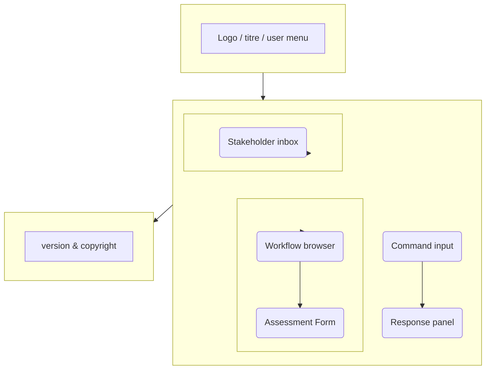

# Prototype : écran principal du Dashboard BMAD

Cet écran représente l'interface de base pour l'approche MVP.
Il a été inspiré par le composant `BmadInterface.vue` déjà développé dans
**management-dashboard**, et sert de modèle pour la suite du développement.

## Objectifs du prototype

1. Montrer le champ de saisie de commandes BMAD (texte).  
2. Afficher la liste des workflows regroupés par phase.  
3. Présenter le panneau des demandes stakeholders avec types colorés.  
4. Prévoir un espace pour les réponses / conseils retournés par BMAD.
5. Inclure un formulaire MVP pour l'Assessment Framework (Pre-Development et Live Product).

L'ensemble doit être accessible sans installation, responsive et léger.

## Wireframe visuel



> Le wireframe ci-dessus est intentionnellement simple. Il montre la structure
générale sans détails de style. Le prototype réel sera réalisé en Vue 3 avec
Tailwind, mais le diagramme aide à communiquer l'agencement.

## Composant AssessmentForm MVP

### Description
Le composant `AssessmentForm` permet de lancer une évaluation rapide basée sur l'Assessment Framework BMAD. Il offre deux types d'assessments : Pre-Development et Live Product.

### Structure du formulaire
- **Sélecteur de type** : Boutons radio pour "Pre-Development" ou "Live Product"
- **Champs principaux** :
  - Nom du produit/projet
  - Description brève
  - Dimensions à évaluer (liste à cocher basée sur ADEO POM)
- **Bouton d'action** : "Lancer Assessment"
- **Résultats** : Affichage des scores par dimension avec recommandations

### Pseudo-code Vue

```vue
<template>
  <div class="assessment-form bg-white p-4 rounded shadow">
    <h3 class="text-lg font-semibold mb-4">Assessment Framework MVP</h3>
    
    <div class="mb-4">
      <label class="block text-sm font-medium mb-2">Type d'Assessment</label>
      <div class="flex gap-4">
        <label class="flex items-center">
          <input type="radio" v-model="assessmentType" value="pre-dev" class="mr-2">
          Pre-Development
        </label>
        <label class="flex items-center">
          <input type="radio" v-model="assessmentType" value="live" class="mr-2">
          Live Product
        </label>
      </div>
    </div>
    
    <div class="mb-4">
      <label class="block text-sm font-medium mb-2">Nom du Produit/Projet</label>
      <input v-model="productName" type="text" class="w-full p-2 border rounded">
    </div>
    
    <div class="mb-4">
      <label class="block text-sm font-medium mb-2">Description</label>
      <textarea v-model="description" class="w-full p-2 border rounded" rows="3"></textarea>
    </div>
    
    <div class="mb-4">
      <label class="block text-sm font-medium mb-2">Dimensions à évaluer</label>
      <div class="grid grid-cols-2 gap-2">
        <label v-for="dim in dimensions" :key="dim.id" class="flex items-center">
          <input type="checkbox" v-model="selectedDimensions" :value="dim.id" class="mr-2">
          {{ dim.name }}
        </label>
      </div>
    </div>
    
    <button @click="runAssessment" class="bg-blue-500 text-white px-4 py-2 rounded hover:bg-blue-600">
      Lancer Assessment
    </button>
    
    <div v-if="results" class="mt-4 p-4 bg-gray-50 rounded">
      <h4 class="font-semibold">Résultats</h4>
      <div v-for="result in results" :key="result.dimension" class="mb-2">
        <span class="font-medium">{{ result.dimension }}:</span> {{ result.score }}/100 - {{ result.rating }}
      </div>
      <p class="text-sm text-gray-600 mt-2">{{ recommendation }}</p>
    </div>
  </div>
</template>

<script setup lang="ts">
import { ref, computed } from 'vue'

const assessmentType = ref('pre-dev')
const productName = ref('')
const description = ref('')
const selectedDimensions = ref([])
const results = ref(null)

const dimensions = [
  { id: 'strategy', name: 'Strategy & Product Alignment' },
  { id: 'ux', name: 'User Experience & Design' },
  { id: 'tech', name: 'Technical Architecture' },
  { id: 'ops', name: 'Operations & Support' },
  { id: 'quality', name: 'Product Quality' },
  { id: 'risk', name: 'Risk Assessment' }
]

const recommendation = computed(() => {
  if (!results.value) return ''
  const avgScore = results.value.reduce((sum, r) => sum + r.score, 0) / results.value.length
  if (avgScore >= 90) return 'Excellent! Prêt pour le développement.'
  if (avgScore >= 75) return 'Bon niveau. Quelques améliorations mineures recommandées.'
  if (avgScore >= 60) return 'Acceptable mais nécessite des améliorations ciblées.'
  return 'Risques élevés. Révision stratégique recommandée.'
})

const runAssessment = () => {
  // Simulation d'un assessment simple
  results.value = selectedDimensions.value.map(dimId => {
    const dim = dimensions.find(d => d.id === dimId)
    const score = Math.floor(Math.random() * 40) + 60 // Score aléatoire 60-100 pour démo
    let rating = 'Acceptable'
    if (score >= 90) rating = 'Exemplary'
    else if (score >= 75) rating = 'Good'
    return { dimension: dim.name, score, rating }
  })
}
</script>
```
<template>
  <div class="dashboard">
    <header class="h-12 bg-gray-100 flex items-center px-4">
      <h1 class="text-lg font-bold">BMAD Dashboard</h1>
    </header>

    <main class="p-4 grid grid-cols-1 md:grid-cols-3 gap-4">
      <section class="col-span-3">
        <CommandInput />
        <BmadResponse />
      </section>

      <section class="md:col-span-1">
        <WorkflowBrowser />
        <AssessmentForm />
      </section>

      <section class="md:col-span-2">
        <RequestInbox />
      </section>
    </main>

    <footer class="h-10 bg-gray-100 text-center text-xs">
      v0.1 - BMAD Method
    </footer>
  </div>
</template>

<script setup lang="ts">
import CommandInput from './components/CommandInput.vue';
import BmadResponse from './components/BmadResponse.vue';
import WorkflowBrowser from './components/WorkflowBrowser.vue';
import RequestInbox from './components/RequestInbox.vue';
</script>

<style scoped>
/* styles simples ou import Tailwind */
</style>
```

## Prochaine étape

- Transformer ce prototype en maquette Figma ou en composant Vue réel.  
- Intégrer un jeu de données factices pour valider le comportement interactif.
- Discuter du style graphique (couleurs, typographie, badges de type de demande).
- Développer le composant AssessmentForm pour le formulaire MVP de l'Assessment Framework.

Ce prototype fournit un point de départ clair pour les designers et développeurs.  
N'hésite pas à me dire si tu veux une version plus détaillée ou un prototype live HTML.
